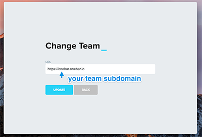
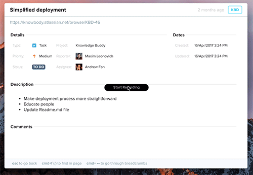

OneBar.io Guide
=================

OneBar is a desktop app, looking similar to Apple Spotlight, but providing a totally different experience. Instead of searching your computer, OneBar lets you search through your company cloud.

 OneBar server pulls the data from private systems in the company, such as JIRA, Google Docs, Slack, git repositories and others, indexes it and then lets people search through the web interface or an OneBar desktop app.

OneBar shows rich previews of the content right in the app and drastically reduces the number of clicks and context switches you need to make in order to get your answer.

# Adding sources

Before you can start searching, you should add some data sources.
Check out the [Integrations guide](integrations.md) on how to do that.

# Desktop app

The most convenient way to use OneBar is via OneBar desktop app.
Available builds:

- [Mac OS dmg](https://onebar.io/onebar/download/dmg)
- [Linux deb](https://onebar.io/onebar/download/deb)
- [Linux rpm](https://onebar.io/onebar/download/rpm)

On the first start, it will ask you to enter your team URL.
Please use the team subdomain, you've choosen during the registration, or a custom URL if you're using on-prem installation.

You can later change the team URL by right-clicking on the onebar tray icon and chosing "Change team" or pressing `Cmd(Ctrl)+Shift+T` shortcut.

Use `Cmd(Ctrl)+Shift+O` to access OneBar search bar. You can change the shortcut through the "My profile" page, available from the tray icon menu.

# Searching

Press `Cmd(Ctrl)+Shift+O` to bring up a search bar and type your query.
By default you're searching the whole index, but you can narrow down the scope by using search modifiers. Currently available modifiers are:

- **in:** (code, docs, jira, gitlog)
- **type:** (file extension)
- **project:** (project name)
- **last:** (day, week, month)

Clink on the result or hit `Enter` to see the full document preview.

You can select any word or phrase you see and start a new search, without leaving the current document preview.

# Keyboard shortcuts

Keep an eye on the shortcuts bar at the bottom of the window. Depending on the context, it shows you available keyboard shortcuts. Use them to make your search experience smoother and faster.

# Help and Support

Feel free to contact us with any questions via Help and Support form. It's available in the tray icon menu or through the chat icon in the web app.
You can also open [issues](https://github.com/onebar/onebar-guide/issues) in this repository.
